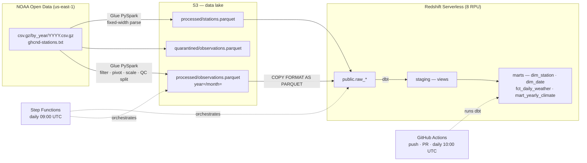
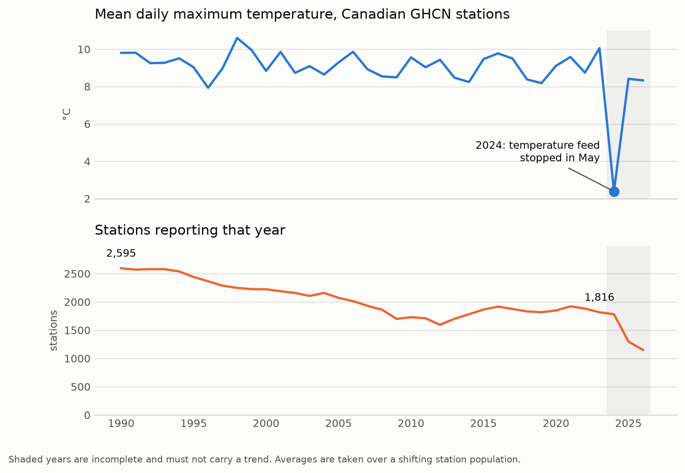
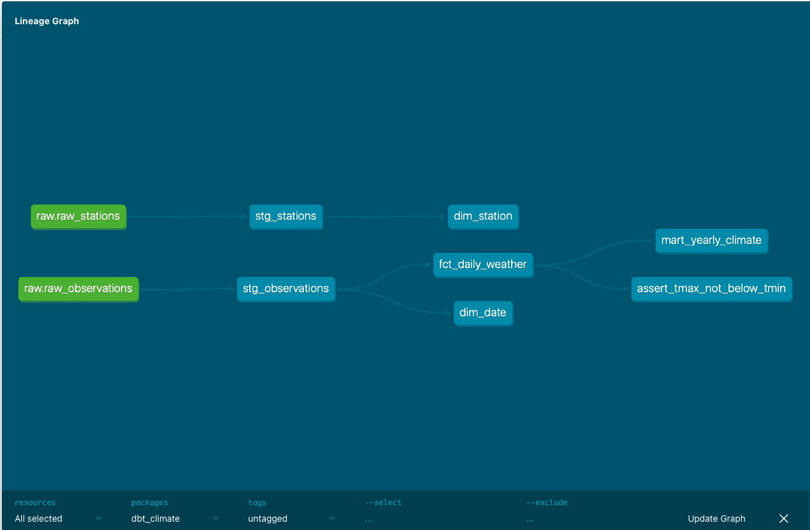
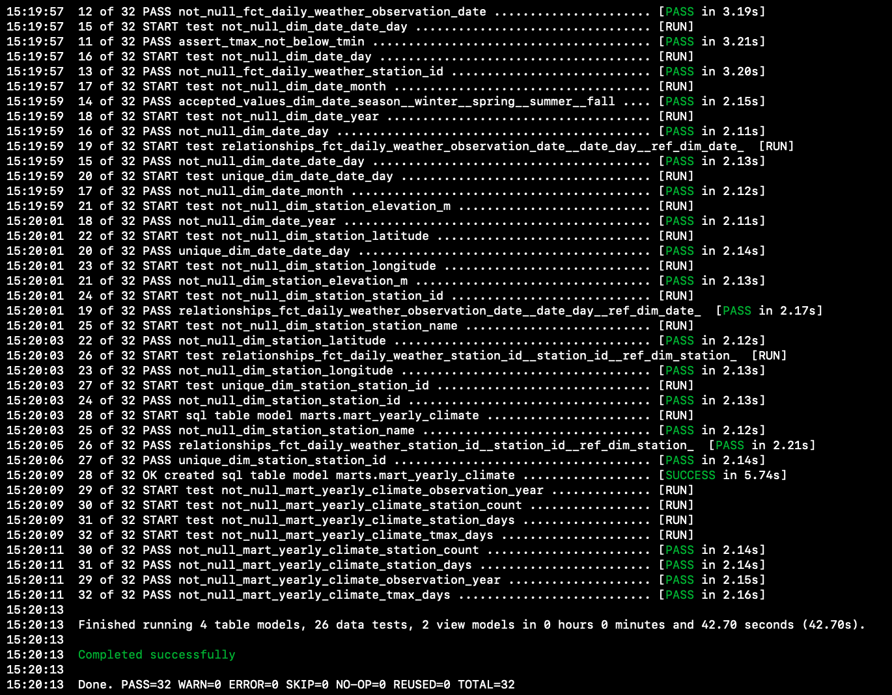
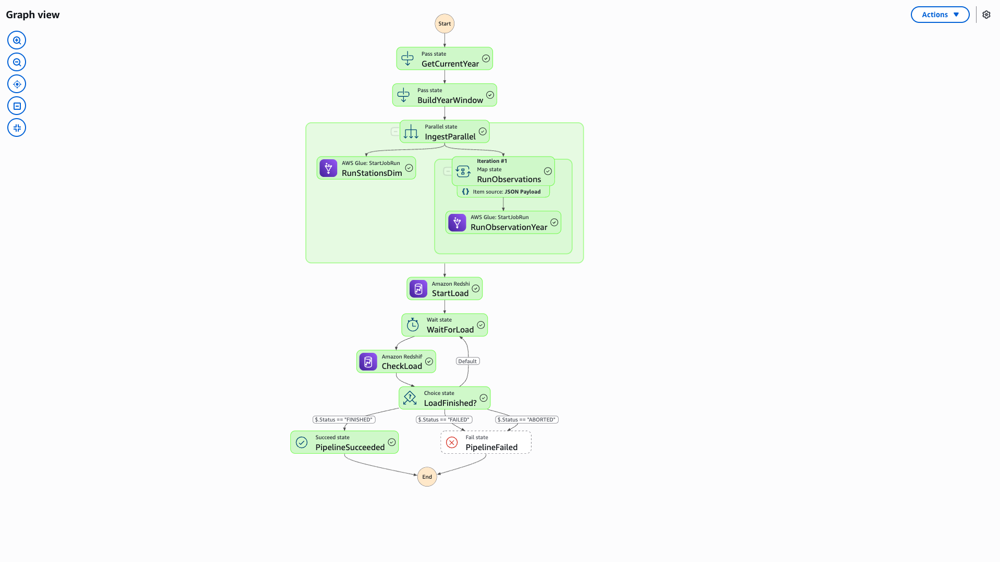
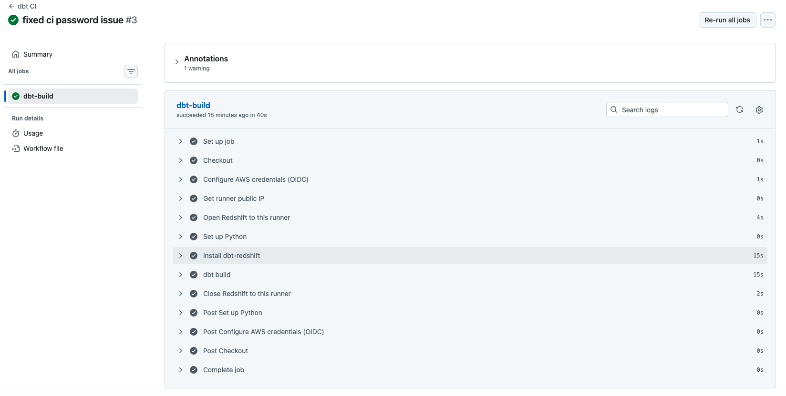

# Canada Climate Pipeline

A batch pipeline over NOAA's Global Historical Climatology Network — Daily (GHCN-Daily),
scoped to Canada. It scans **~1.3 billion global observations**, keeps the
**22.4 million Canadian station-days** that matter, models them as a star schema in Redshift,
and publishes a yearly climate mart that **states its own limitations** rather than hiding them.

Every number in this README came out of the pipeline and reconciles end to end: the row
counts measured with Spark during profiling are the same row counts the dbt marts produce
six stages later.

| | |
|---|---|
| Source | NOAA GHCN-Daily via the AWS Open Data registry (`s3://noaa-ghcn-pds`) |
| Scanned per full backfill | ~1.3 billion rows (all countries, 1990–present) |
| Retained | **22,366,712** station-days · **9,362** Canadian stations |
| Stack | S3 · Glue (PySpark) · Athena · Redshift Serverless · dbt · Step Functions · EventBridge · GitHub Actions |
| Scheduled run | ~5 minutes end to end, 29 state transitions |
| Tests | 26 dbt tests, green in CI on every push and nightly |

---

## Architecture



Glue does **pre-warehouse, file-level** work: filtering, the long→wide pivot, per-element unit
scaling, and quality quarantine. dbt does **post-warehouse, SQL-level** modelling. They are a
division of labour, not alternatives.

---

## What this dataset does to you if you don't look

The deliverable is not the pipeline — it is a mart whose numbers can be trusted, and getting
there meant finding out where the data lies.



| Year | Stations | Station-days | TMAX days | TMAX share | Mean TMAX °C |
|---:|---:|---:|---:|---:|---:|
| 1990 | 2,595 | 847,169 | 705,005 | 0.832 | 9.80 |
| 2005 | 2,071 | 656,153 | 585,442 | 0.892 | 9.29 |
| 2022 | 1,882 | 541,898 | 338,944 | 0.625 | 8.74 |
| 2023 | 1,816 | 523,489 | 326,801 | 0.624 | 10.05 |
| 2024 | 1,782 | 327,416 | 120,013 | 0.367 | **2.39** |
| 2025 | 1,299 | 355,801 | 167,768 | 0.472 | 8.41 |

**Three findings, all measured rather than assumed:**

**The reporting network shrinks, and not at random.** Canadian stations reporting fell from
2,595 in 1990 to 1,816 in 2023 — and for TMAX specifically, from 2,241 to 1,013, a 55% drop.
Remote northern sites are the expensive ones to maintain, so *which* stations report is
correlated with the very quantity being measured. Any trend such a chart appears to show is
partly station composition, not climate. Every yearly figure therefore ships with
`station_count` beside it. That **exposes** the bias; it does not correct it, and the mart
says so.

**2024 is broken, and it is Canada alone.** Mean TMAX reads **2.39 °C** against ~9 °C in every
other year. A Canada-specific upstream feed stopped delivering temperature to GHCN from May
2024: TMAX collapses to ~8% of normal while precipitation only halves, and the United States,
Australia and Russia run flat through the same months. Station *counts* for 2024 are
unaffected and remain sound; anything counted or averaged per year is not.

**The measurement standard drifted too.** The TMAX share of station-days fell from 0.89 in
2005 to 0.62 in 2022 — a slow structural shift, entirely separate from the 2024 fault, as more
stations report precipitation only. TAVG went the other way, from 86 Canadian stations to 896,
which is a change in instrumentation rather than in weather. Trend metrics are therefore
derived from TMAX/TMIN; TAVG is carried as a reported column only.

---

## Modelling



`raw_*` (loaded by `COPY`) → `stg_*` (rename, units in column names) → `dim_*` / `fct_*` →
`mart_yearly_climate`. Units live in the column names — `tmax_c`, `prcp_mm`, `snow_fall_mm` —
because GHCN's scaling factor **differs per element**: temperature and precipitation are
published in tenths, snowfall and snow depth are not. A blanket `/10`, the obvious
implementation, silently divides both snow columns by ten and produces no error, no null and
no failed test.

`fct_daily_weather` is distributed on `station_id` and sorted on `observation_date`;
`dim_station` is `DISTSTYLE ALL`. The distribution key is not chosen for the join — with a
9,362-row dimension replicated to every node the join is already local — but for
`COUNT(DISTINCT station_id)`, which is the `station_count` column the whole mart rests on.



26 tests, each one pinning an assumption that was verified first: `unique` on the station key
(9,362 rows / 9,362 distinct ids), `relationships` from fact to dimension (zero orphans across
22.4M rows, checked in Athena before the warehouse existed), and a singular test asserting
`tmax_c >= tmin_c` — a regression check for the day NOAA's own quality control misses
something it currently catches.

---

## Orchestration



EventBridge Scheduler fires the state machine daily at 09:00 UTC — six hours after NOAA
regenerates its corpus at 02:22 UTC. The machine derives a **rolling two-year window** from the
execution timestamp, runs the station dimension and both observation years in parallel with
`glue:startJobRun.sync`, then loads Redshift through the Data API and polls
`describeStatement` until the batch finishes.

Two details that matter more than they look:

- **`.sync`** — without it, `COPY` starts reading Parquet that Spark is still writing, and the
  result is a wrong row count with no error anywhere.
- **`DELETE FROM` rather than `TRUNCATE`** — `TRUNCATE` commits in Redshift and cannot be
  rolled back, so a failed `COPY` would leave the warehouse empty. `DELETE` keeps the
  `batchExecuteStatement` batch atomic, and is also the privilege that can actually be granted
  to a role.

A run that picked up a year the original backfill never had (2026: 203,744 rows) reprocessed
2025 at the same time and produced **byte-identical** output — 355,801 rows, unchanged. The
idempotency claim is measured, not asserted.

## CI/CD



`dbt build` runs on every push and pull request, and again nightly at 10:00 UTC. The workflow
authenticates to AWS with **OIDC — no long-lived credentials are stored anywhere** — then opens
the runner's public IP on the Redshift security group, builds, and revokes the rule with
`if: always()` so a failed run still cleans up after itself.

---

## Selected design decisions

The full log is 13 ADRs kept alongside the code. Five that show the shape of the reasoning:

**Ingest `by_year`, not `by_station` — the cheaper option was measured and rejected.**
Selecting the 9,362 `CA*` station files reads 7.78 GB against ~47 GB for the yearly files:
roughly 6× less I/O, and the numbers are mine. It was still the wrong choice, because station
files carry a station's *entire* history with no time dimension, so a daily incremental run
would have to read all 7.78 GB to extract ~2 MB of new observations. The I/O saved once on
backfill is paid back, in full, every day. **Layout should match the reprocessing unit.**

**Filter to Canada immediately after read.** This looked like a trade-off between cost and
demonstrating scale, until profiling showed the trade-off does not exist: the source is
partitioned by year, not country, so Spark reads all ~1.3 billion rows either way. Bytes read
from S3 are identical. The filter's position changes nothing upstream and everything
downstream — the long→wide pivot is a shuffle, and running it on 90 million rows instead of
1.3 billion is a 14× saving on the single costliest stage.

**Validation follows the measured data, not the format documentation.** The `-9999` missing
sentinel is documented for GHCN — and appears in **0 of 37,101,898 rows** of this
distribution, because it belongs to the fixed-width `.dly` format where absent days still
occupy a slot. In the long-form CSV a missing observation is an absent *row*. A rule matching
zero rows is worse than no rule: it reads as coverage that is not there. Quarantine is driven
by NOAA's own `Q_FLAG` (0.098% of rows), and completeness is checked as absence in dbt.

**No `is_trend_eligible` column.** It is tempting to flag 1990–2023 as the usable range, but
that is a judgement with a hard-coded constant that will rot. The mart ships `station_days`
and `tmax_days` instead — the evidence the judgement was made from — and states the judgement
in the model's description, where `dbt docs` renders it. **Judgement in the documentation,
evidence in the data.**

**Redshift's `PRIMARY KEY` is not enforced.** It is planner metadata, so declaring one that is
not actually unique produces wrong results rather than an error. Both keys here were verified
before being declared — and `not_null` tests on columns already declared `NOT NULL` were
*removed* after `EXPLAIN` showed Redshift planning them as `One-Time Filter: false`, never
reading the table. A test that passes without touching the data is worse than no test.

---

## Known limitations

Stated because they are real, not because they are small.

- **Deep-history revisions are not picked up.** NOAA regenerates the entire `by_year` corpus
  daily — 264 of 265 objects rewritten every morning, including files from 1874 — so
  `LastModified` cannot identify which years actually changed. The scheduled run reprocesses a
  rolling two-year window; revisions to older years need a manual backfill. Closing this
  properly requires content-level change detection.
- **dbt is not in the orchestration.** Step Functions refreshes the raw tables; GitHub Actions
  builds the marts an hour later. The two are aligned **by clock, not by dependency**. Running
  dbt from the orchestrator would need a Fargate task, since Step Functions has no general
  compute primitive.
- **`station_count` exposes the composition bias; it does not remove it.** The statistically
  honest correction is a fixed station panel or an anomaly-based method that differences each
  station against its own baseline. Both were rejected on build cost, not on merit.
- **`dim_date` is derived from observed dates, not generated.** Measured complete — 13,149
  days, exactly 1990–2025 with no gaps — but that is an observed property. A day on which no
  Canadian station reported would be silently absent.
- **The warehouse is publicly reachable**, with the security group admitting a single `/32` at
  a time. That is a development convenience so dbt can run locally and in CI; production would
  keep it private behind a VPN or an SSM port-forward.

---

## Repository layout

```
jobs/          Glue PySpark jobs — clean_observations.py, stations_dim.py
scripts/       backfill, profiling, plotting, and the security-group helper
warehouse/     Redshift DDL and the COPY load script
dbt_climate/   dbt project — staging → marts, 26 tests
dbt_profiles/  dbt connection profile (credentials via env_var)
infra/         IAM trust and permission policies, Step Functions definition
docs/          Figures and the CSV extracts behind them
```

## Running it

```bash
# Glue jobs run locally against data/ or on Glue against s3:// — the paths are arguments,
# and pyspark is pinned to 3.5.6 to match the Glue 5.1 runtime.
python jobs/clean_observations.py --year 2024

# Historical load, one Glue job run per year so a failed year retries on its own
./scripts/backfill.sh 1990 2025

# Warehouse — run these against the workgroup (Query Editor v2, or the Data API)
#   warehouse/ddl.sql    tables, distribution and sort keys
#   warehouse/load.sql   DELETE + COPY, one transaction

# Models
export REDSHIFT_DBT_PASSWORD=...          # profiles.yml reads it via env_var
source dbt-venv/bin/activate
cd dbt_climate && dbt build --target prod

# Or drive the whole thing the way the schedule does
aws stepfunctions start-execution \
  --state-machine-arn arn:aws:states:us-east-1:<account>:stateMachine:canada-climate-pipeline
```

## Attribution

Data: NOAA Global Historical Climatology Network — Daily (GHCN-Daily), retrieved from the AWS
Open Data registry via the NOAA Open Data Dissemination programme.
Licence: CC0-1.0 (public domain dedication).
